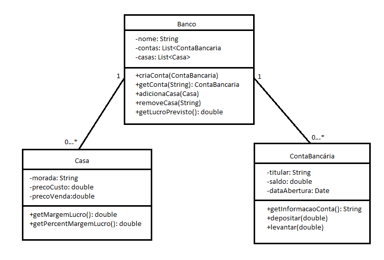

# Ficha3
Ficha3 das aulas práticas de laboratório de programação

## Descrição do projeto
Este projeto utiliza os conceitos de POO para praticar conhecimentos básicos de java.
É constituído por bancos, que têm associados listas de casas e contas bancárias, aos quais é possivel aplicar alguns métodos.

###  Classes e argumentos:
1. Banco: tem um nome, uma lista de contas bancárias e uma lista de casas
2. Casa: tem uma morada, um preço compra e um preço de venda
3. ContaBancaria: tem o nome do seu titular, o saldo associado e a data em que a conta foi aberta

### Classes e métodos:
1. Banco: permite adicionar contas e casas às respetivas listas, remover uma casa, obter uma conta pelo nome do seu titular e a soma do lucro previsto com a compra e venda detodas as casas associadas
2. Casa: permite obter a margem de lucro absoluta (venda-compra) ou por percentagem (venda/compra)
3. ContaBancaria:permite aceder a todas as informaçoes da conta, levantar e depositar dinheiro

### Main
Foram desenvolvidos 4 Mains distintos para testar casa funcionalidade conforme os exercícios da Ficha3. O nome de cada ficheiro é "MainExY", onde Y é o número do exercicio a que está associado esse código

## Diagrama de classes
As classes descritas no ponto anterior podem ser representadas pelo seguinte diagram de classes em formato UML:

